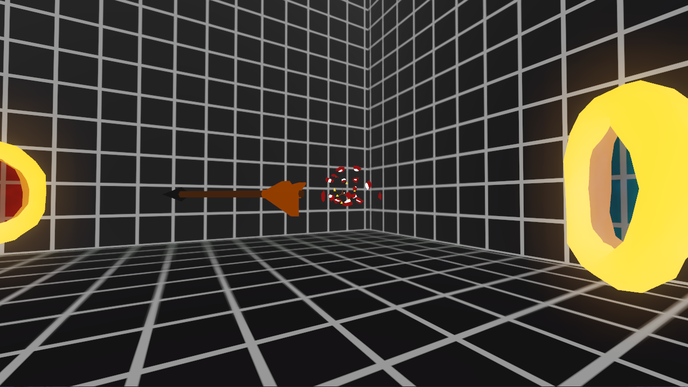
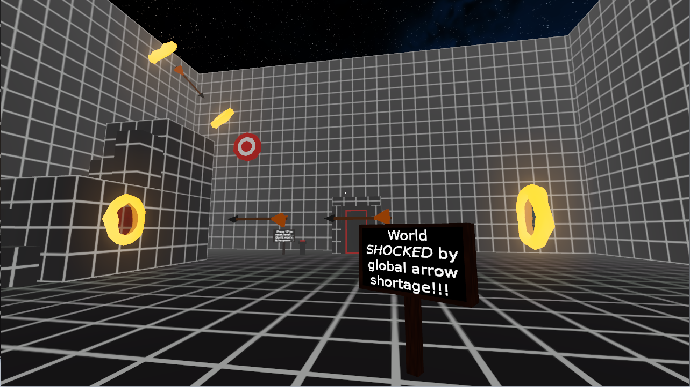

# Shafted

A short first-person puzzle game created for Ludum Dare 47 with the theme "Stuck in a loop".

Made with Godot in a weekend.

[Download](https://github.com/sundowns/shafted/releases/tag/1.0)

[Jam Submission Page](https://ldjam.com/events/ludum-dare/47/shafted)

## Credit

- Programming, Design, 3D Modelling - Tom Smallridge ( [Sundowns](https://github.com/sundowns) )
- Audio/Music - Max Chapman ( [Chappos](https://github.com/chappos) )

## Screenshots

## Controls

| Key    |    Action    |
| ------ | :----------: |
| WASD   |     Move     |
| Mouse1 |     Push     |
| CTRL   |    Crouch    |
| Space  |     Jump     |
| E      | Press button |
